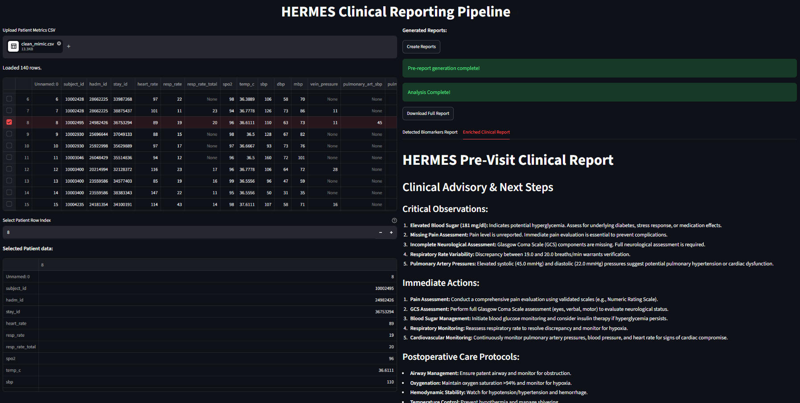
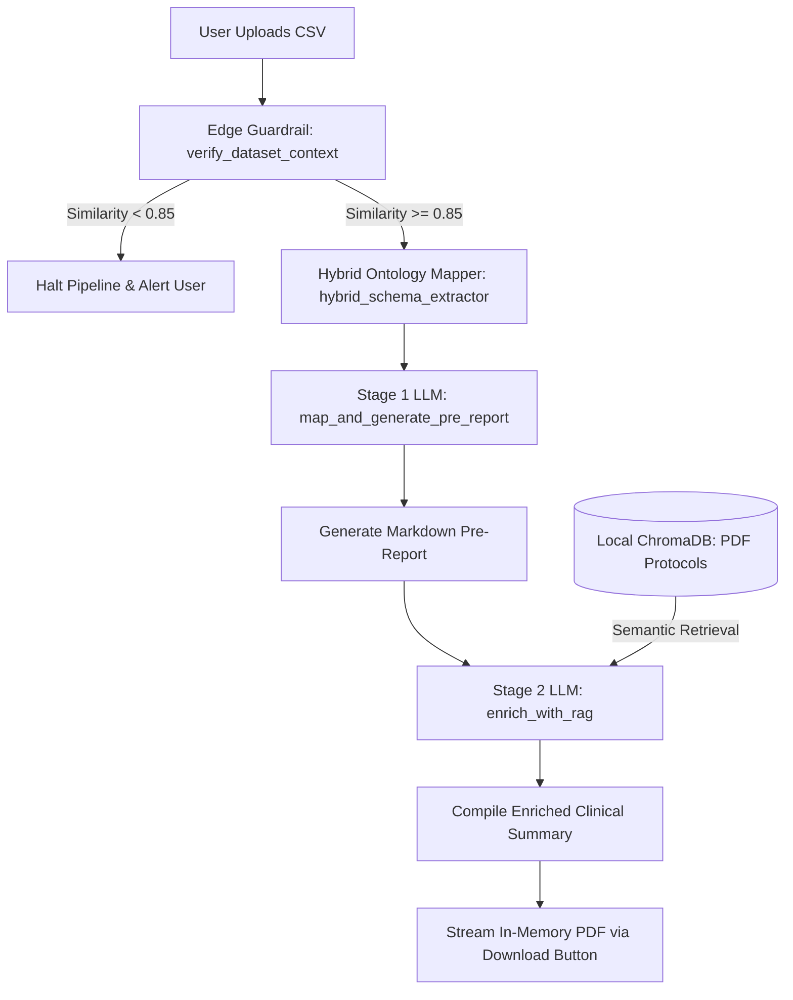

# ⚚ HeRMeS: Health Report & Monitoring System

An automated, defensive clinical data processing and semantic reporting pipeline. HeRMeS **transforms unstructured or loosely structured machine-friendly data** formats (`.csv`) **into comprehensive, context-enriched clinical pre-visit reports** designed for healthcare professionals.

Rather than acting as a naive prompt wrapper, HeRMeS serves as a reliable middle-layer. It safely ingests patient vitals, verifies semantic domain boundaries at the system edge, aligns fragmented hospital schemas with standardized medical ontologies, and injects validated clinical guidelines through a specialized Retrieval-Augmented Generation (RAG) architecture.

<center>

  
*HeRMeS App interface (Streamlit)*
</center>

## 📒 Table of Contents
- [📈 Technical Highlights \& Engineering Innovations](#-technical-highlights--engineering-innovations)
- [🏗️ Architectural Topology \& Workflow](#️-architectural-topology--workflow)
- [⚙️ Core Pipeline Sequence](#️-core-pipeline-sequence)
- [📁 Project Directory Tree (Main files)](#-project-directory-tree-main-files)
- [🛠️ Technologies \& Dependencies](#️-technologies--dependencies)
- [🚀 Installation \& Quickstart](#-installation--quickstart)
  - [1. Initialize the Repository \& Environment](#1-initialize-the-repository--environment)
  - [2. Configure Local Environment Variables](#2-configure-local-environment-variables)
  - [3. Run the System](#3-run-the-system)
- [📦 Deployment (Docker)](#-deployment-docker)
  - [Prerequisites](#prerequisites)
  - [🗃️ Persistent Data Volumes](#️-persistent-data-volumes)
  - [🧹 Stopping and Maintenance](#-stopping-and-maintenance)
- [🧠 Strategic Design Decisions](#-strategic-design-decisions)
  - [1. Low-Temperature Deterministic Prompting](#1-low-temperature-deterministic-prompting)
  - [2. Edge Guardrailing over Core Text Validation](#2-edge-guardrailing-over-core-text-validation)
  - [3. In-Memory Streaming vs. Persistent Storage Caching](#3-in-memory-streaming-vs-persistent-storage-caching)
- [📝 Example System Outputs](#-example-system-outputs)
  - [Input Matrix Data (Example Patient Row)](#input-matrix-data-example-patient-row)
  - [Stage 1: Template Structuring Format](#stage-1-template-structuring-format)
  - [Stage 2: Enriched RAG Document Preview](#stage-2-enriched-rag-document-preview)
- [🛑 Current Technical Boundaries \& Future Roadmap](#-current-technical-boundaries--future-roadmap)
- [📄 License \& Attribution](#-license--attribution)


## 📈 Technical Highlights & Engineering Innovations

* **Deterministic Multi-Stage Prompt Pipeline**: Replaces unpredictable "autonomous agents" with a reliable, sequential two-stage orchestration topology. Stage 1 executes structural schema transformations, and Stage 2 runs clinical reasoning, preventing compounding model drift.
* **Sub-Millisecond Semantic Guardrailing**: Employs an offline, local vector embedding validator to score incoming metadata. It identifies and blocks out-of-domain files (e.g., agricultural data, financial records) immediately at the application gateway before consuming remote inference tokens or querying vectors.
* **Ontology-Inspired Fuzzy Mapping Engine**: Bypasses the strict keyword limitations of conventional ETL pipelines. Using optimized character edit-distance string alignment, it translates fragmented hospital indicators (`hr`, `vp`, `temp_c`) into structured clinical identifiers mapped directly to Unified Medical Language System (UMLS) concepts.
* **Localized, Low-Latency RAG Integration**: Anchors clinical reasoning to a persistent, locally managed ChromaDB database populated with chunked clinical guidelines and PDFs, ensuring all recommended monitoring steps are grounded in verified protocols.
* **Zero-Footprint Document Streamer**: Generates multi-section, beautifully typeset clinician reports completely in-memory via temporary bytes streaming. This minimizes concurrent file-system collisions and leaves zero residual cached data on the host disk.

## 🏗️ Architectural Topology & Workflow

HeRMeS separates layout translation, semantic validation, local data retrieval, and document generation into independent, clean modules:


## ⚙️ Core Pipeline Sequence

* **Validation & Filtering**: The file headers are evaluated using local vector representations to compute cosine similarities against verified clinical layouts.
* **Fuzzy Extraction & Mapping**: Features match against an ontology map with character edit-distance tracking. A unified row data vector is then generated.
* **Stage 1 (Mapping & Structuring)**: The structural metrics are mapped into a standardized template format, automatically separating core biomarkers from auxiliary context parameters.
* **Stage 2 (Retrieval & Enrichment)**: The structured template queries the native ChromaDB collection. Pertinent clinical standard guidelines are fetched and passed to the model alongside the patient metrics to generate an actionable, fully-grounded observation report.

## 📁 Project Directory Tree (Main files)

```bash
hermes/
├── __init__.py
│
├── assets/                     # LLM setup prompts & dataset files storage
├── config/
│   └── config.py               # Project pathing and template & onthology data setup
├── core/
│   ├── mapping.py              # Dataframe analysis and mapping to target columns
│   ├── rag.py                  # Text splitting, chunk vectorization and input enrichment
│   └── semantics.py            # Local Vector Guardrails & Fuzzy Ontology Mapping
├── demos/                      # Initial demos for LLM pipeline(Legacy)
├── utils/                      # Aux & helper functions and boilerplate code
│
├── app.py                      # Interactive Streamlit Web Interface Dashboard
├── docker-compose.yaml         # Docker container composition file
├── Dockerfile                  # Docker image building file
├── main.py                     # Execution Entrypoint for Batch/CLI Pipelines
├── .env.template               # Template for Environment Ingestion Variables
├── pyproject.toml              # Python System Package Data
└── uv.lock                     # Python Dependencies Info
```


## 🛠️ Technologies & Dependencies

* **Dashboard Frame Controller**: Streamlit (State-managed, isolated tabs architecture)
* **Data Transformation Layer**: Pandas (Vectorized multi-index pivots & missing cell consolidation)
* **Fuzzy Parsing Optimization**: RapidFuzz (C++ backed Levenshtein string distance engine)
* **Vector Embeddings Processor**: ChromaDB Utilities (`all-MiniLM-L6-v2` Local Transformer Architecture)
* **Inference Gateway Integration**: OpenAI SDK Wrapper (Configured for standard, OpenAI-compatible APIs)
* **Tested Host Models**: `Hermes-4.3-36B` running over local `vLLM` clusters.
* **Document Compilation Subsystem**: Markdown-PDF Parser

## 🚀 Installation & Quickstart

### 1. Initialize the Repository & Environment
Clone the code library and establish your Python execution boundary:

```bash
# Clone the project repository
git clone https://github.com/MiguelPadillaR/hermes.git
cd hermes
```
Install all project dependencies:
- With `uv`:
```bash
# Create and activate a isolated virtual environment with all installed dependencies
uv sync
source .venv/bin/activate  # On Windows use: .venv\Scripts\activate
```
- With `pip`:
```bash
# Create and activate a isolated virtual environment
python -m venv .venv
source .venv/bin/activate  # On Windows use: .venv\Scripts\activate

# Update core packaging tools and install requirements
pip install --upgrade pip
pip install -r requirements.txt
```

### 2. Configure Local Environment Variables
Duplicate the system template configuration layout file:

```bash
cp .env.template .env
```

Open `.env` and fill in your self-hosted inference parameters or API keys:

```ini
# ==========================================
# HERMES CONFIGURATION VARIABLES
# ==========================================
LLM_BASE_URL="http://your-local-cluster-ip:port/v1"
LLM_API_KEY="your_secure_infrastructure_access_token"
LLM_MODEL_NAME="your_deployed_model_name"
DEBUG_MODE="True"
```

### 3. Run the System

**To run the terminal batch processor (uses already downloaded datasets):**
- Artificially generated mock dataset
- MIMIC-IV Clinical processed dataset (default)
```bash
python main.py
```

**To launch the full interactive web application dashboard:**
```bash
streamlit run app.py
```

## 📦 Deployment (Docker)

HeRMeS is fully containerized using `Docker` and `Docker Compose` to ensure a deterministic runtime environment, persistent storage for the local `ChromaDB` vector database, and clean variable isolation.

### Prerequisites
- Make sure you have [`Docker`](https://docs.docker.com/get-docker/) and [`Docker Compose`](https://docs.docker.com/compose/install/) installed and running on your machine.
- Have your `.env` file correctly configured and working (see [_2. Configure Local Environment Variables_](#2-configure-local-environment-variables)).

2. **Build and Launch the Container** Compile the environment dependencies (optimized with `uv`) and spin up the multi-service layer in detached (`-d`, background) mode:
   ```bash
   docker build -t hermes . && docker compose up -d
   ```

3. **Access the Application** Once the container status is healthy, open your web browser and navigate to:
   ```text
   http://localhost:8501
   ```

### 🗃️ Persistent Data Volumes

The Docker Compose configuration maps two crucial host volumes to guarantee data persistence across container rebuilds:
* `./src/db` $\rightarrow$ Mounts the persistent local **`ChromaDB`** vector database storage.
* `./src/reports` $\rightarrow$ Mounts the output destination where generated clinical PDF reports are compiled.

### 🧹 Stopping and Maintenance

To safely halt execution and tear down the virtual container boundaries without destroying your stored database volumes, run:
```bash
docker compose down
```

## 🧠 Strategic Design Decisions

### 1. Low-Temperature Deterministic Prompting
To avoid unpredictable model outputs in clinical applications, both stages of the prompt pipeline enforce strict temperature parameters (`temperature=0.0` to `0.2`). This limits stochastic generation drift, ensuring identical data matrices consistently yield structurally identical conclusions.

### 2. Edge Guardrailing over Core Text Validation
Instead of passing incoming file tables straight to the generation model to ask "Is this a valid file?", HeRMeS processes column arrays locally using mathematical vectors. If the similarity metric fails to meet the baseline configuration, execution halts *before* making network calls. This preserves server computing resources and maintains total network isolation for data that fails validation.

### 3. In-Memory Streaming vs. Persistent Storage Caching
To maintain clean concurrency in web environments, generated reports are processed into byte arrays using `io.BytesIO`. The PDF is served dynamically to the end user's browser runtime and instantly cleaned from memory, preventing user data cross-contamination and disk space exhaustion.

## 📝 Example System Outputs

### Input Matrix Data (Example Patient Row)
```json
{
  "subject_id": 100234,
  "heart_rate": 72,
  "temp_c": 36.5,
  "sbp": 120,
  "dbp": 80,
  "spo2": 99,
  "blood_sugar": 95,
  "SD": 650
}
```

### Stage 1: Template Structuring Format
```markdown
# HERMES Pre-Visit Clinical Report

## Core Biomarkers & Vital Signs
- **Vein Pressure:** Data Unreported
- **Heart Rate:** 72 bpm
- **Temperature:** 36.5 °C
- **Arterial Pressure:** 120/80 mmHg
- **Oxygen Saturation:** 99 %
- **Blood Sugar:** 95 mg/dl

## Additional Contextual Metrics
- **SD (Serosanguineous Drain Output):** 650 mL
```

### Stage 2: Enriched RAG Document Preview
```markdown
### Critical Patient Review
The patient is 2 days post-operative following a complex Whipple procedure. Core vital parameters present as stable (HR: 72 bpm, O2 Sat: 99%). However, observation of 'SD' indicates a highly elevated Serosanguineous Drain Output reading of 650 mL over the active tracking cycle.

### Grounded Protocol Actions (RAG Verification)
According to Surgical Protocol WHI-102, a rapid drop in arterial pressures combined with high-volume abdominal drain tracking signals a significant risk for immediate internal hemorrhaging. 

### Recommended Care Actions:
1. Initiate active, hourly monitoring of the abdominal drainage collection line.
2. Crosscheck arterial pressure charts continuously for sudden, unexpected drops.
3. Alert the surgical team for potential exploratory clinical intervention if output metrics continue to escalate.
```

## 🛑 Current Technical Boundaries & Future Roadmap

* **Single-Row Focus**: The system currently runs evaluations on an individual patient row selected from an index. Future versions could include batch summaries across an entire ICU ward dataset concurrently.
* **Fuzzy Threshold Sensitivity**: Extremely corrupted headers or shorthand acronyms below 3 letters require careful tuning of the `score_threshold` parameters to balance true matches and false positives.
* **Multi-Ontology Graph Expansion**: The local synonym system can be expanded by running offline pre-compilations of whole SNOMED-CT or LOINC tree branches into regional key-value memory blocks. Current implementation supports a number of generic clinical vocabulary for surgical recovery patients.

## 📄 License & Attribution
Distributed under the standard MIT Software License. This system includes research components and structured mock properties inspired by data paradigms defined in the **MIMIC-IV Clinical Open-Access Repository Standard Database Framework**. This tool is intended for demonstration and analytical modeling use cases only.